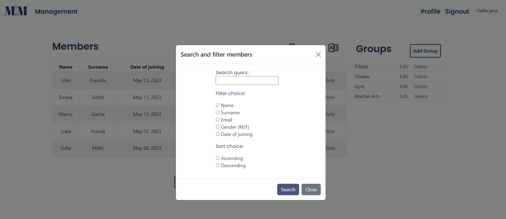

# Members-Management-App

The Members Management App is a web application built with Django that is created for managing members of an association or club. The application provides every registered user with an overview of all their members and 
a simple record of their payment of membership fees in a particular group.

It has a clean and responsive user interface, which is further enhanced by Django's built-in security features that protect against common web vulnerabilities. The app's design and style were crafted using Bootstrap and CSS, resulting in an easy-to-use app.

## Home Page

    </img>  

## Management Dashboard

    </img>  

## Search and Filter

    </img>  

## Edit Member Details

    </img>  

## Group Management

    </img>  

